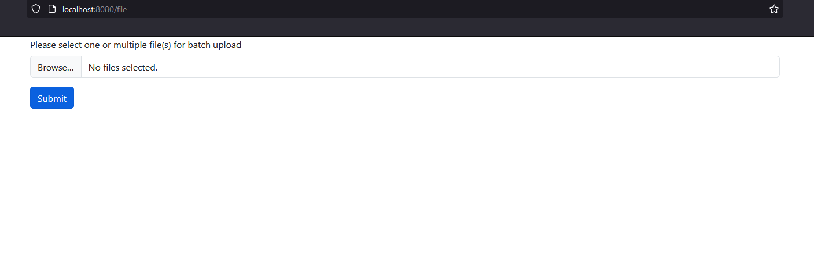
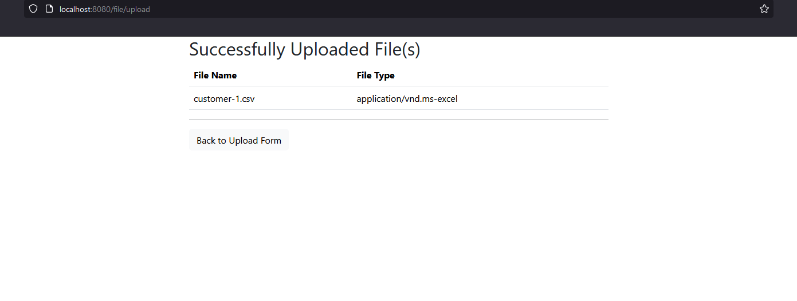

# Spring Batch processing with Kafka integration example

Description: In this project, our goal is to take a file as input
 and read data from a file and process data and then save the
data in database.

1. Thymeleaf : For UI representation and take file as input from user.
2. Spring Batch : For batch processing.
3. Kafka: To publish the processing data using producer and save data in database using consumer.
4. MySql: For database support and store data.
5. Offset Explorer : To visualize and trace data transfer from Kafka producer to consumer.

## Screenshots

# Run project in IDE
- Import project in IDE.
- Build project.
- Start Zookeeper Server.
- Start Kafka Server / Broker.
- Run "Application" class from package "com.tareq".
- Run "ConsumerApplication" class from package "tareq.kafka.consumer".
- Browse "localhost:8080" and upload "customer.csv" file (dummy file is in this project).
- Kafka ConsumerApplication will store data in database. 